# Best Shop
This is an example of a webpage suitable for both desktop and mobile devices.

## Live demo:
https://bestshop-rwd-react.netlify.app/

## Tech Stack:
- React js
- React Router
- React Scroll
- SCSS
- Adobe XD
- RWD
- Netlify

## Screenshots:
- Desktop:

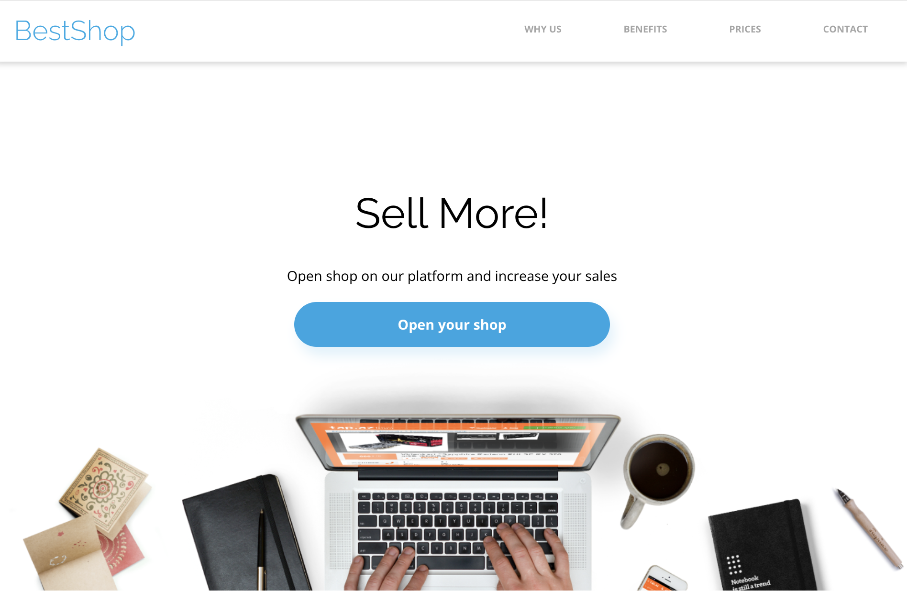
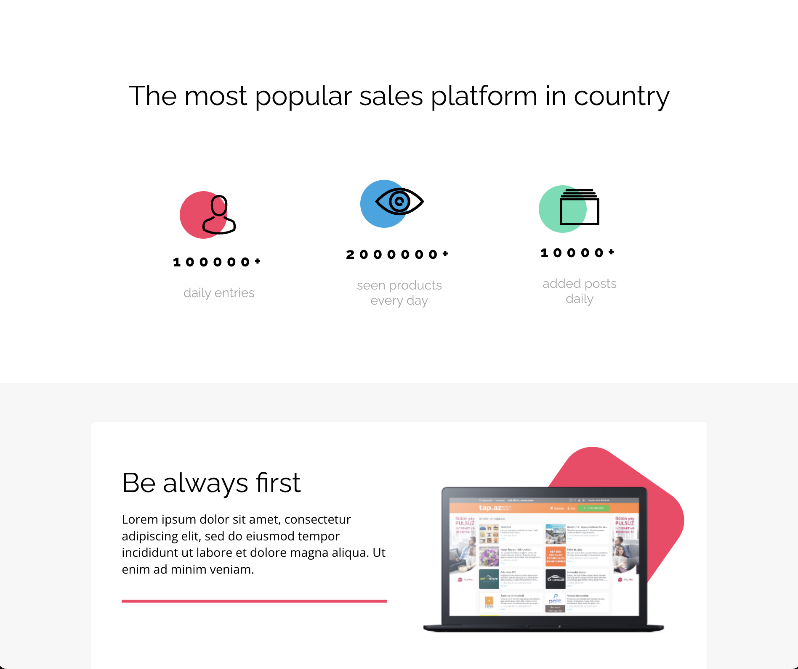
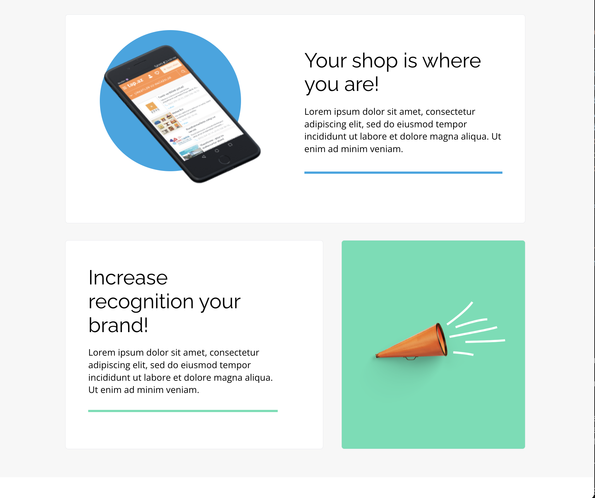
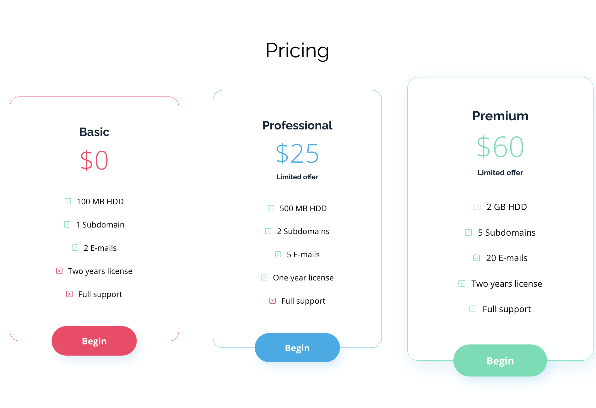
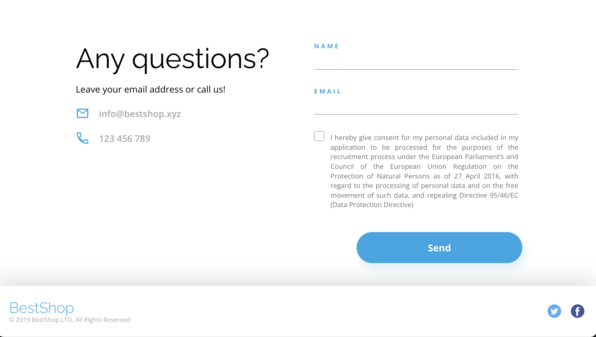

- Mobile:

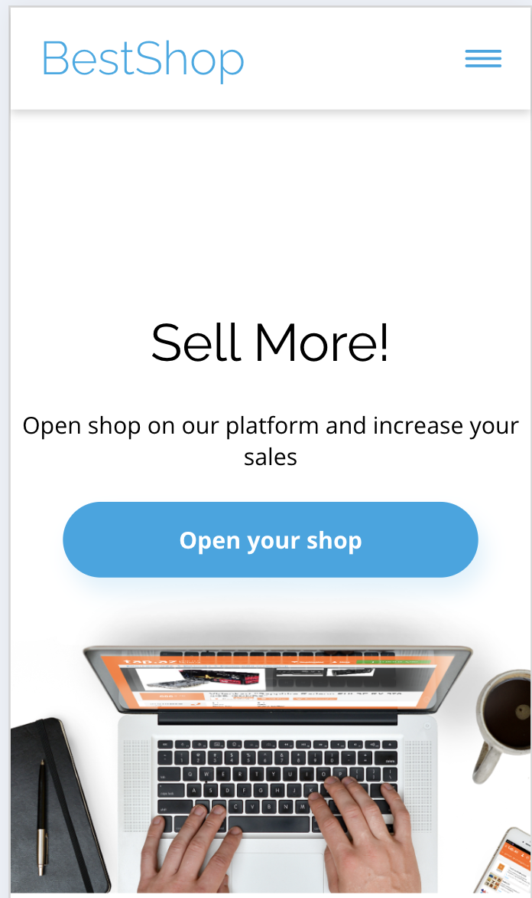
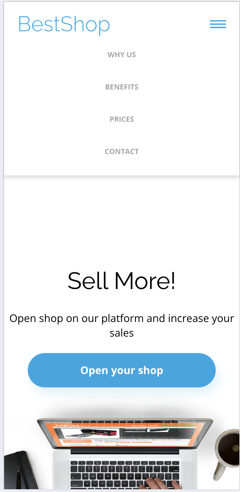
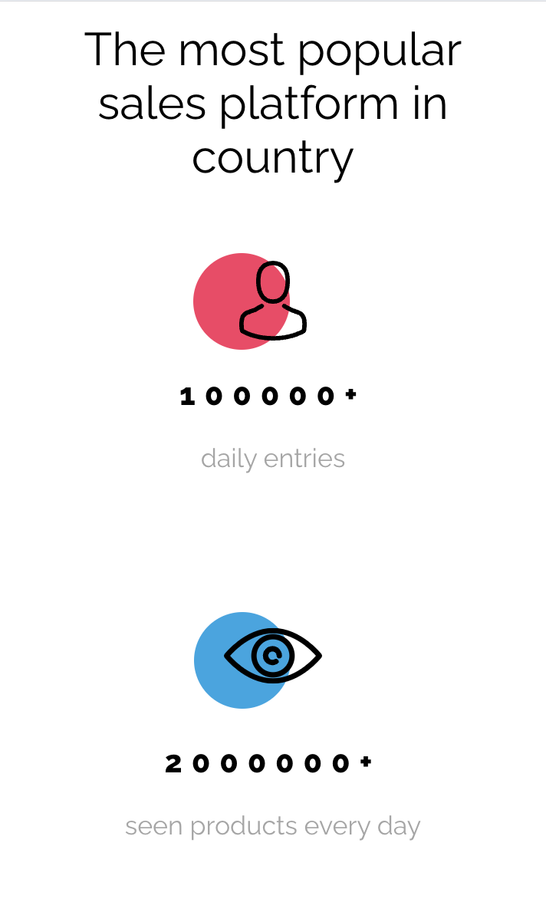
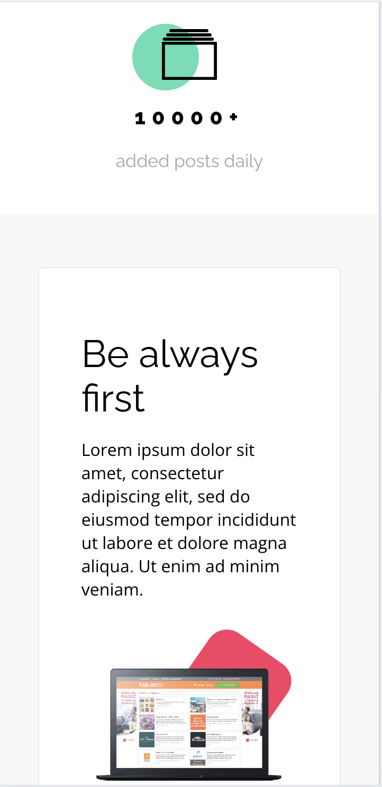
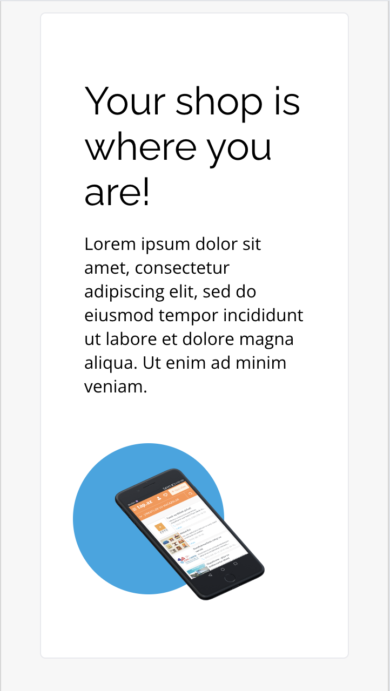
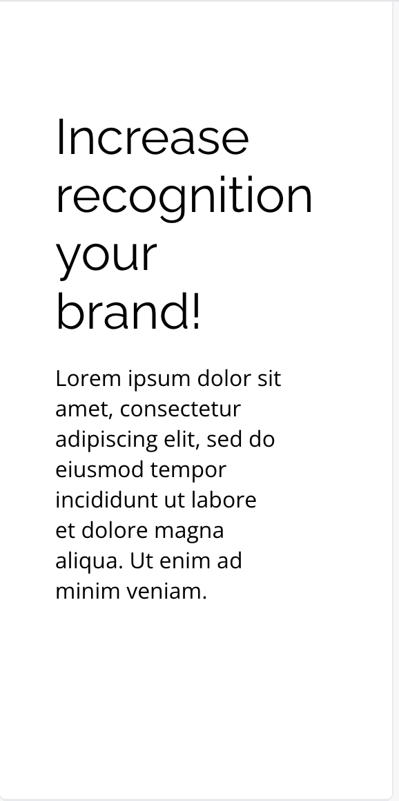
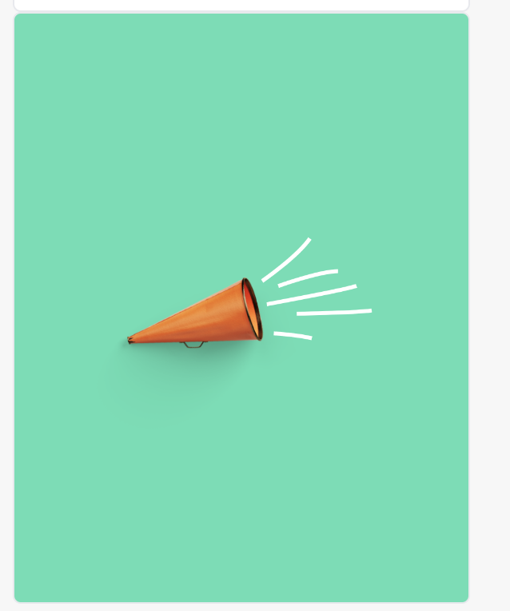
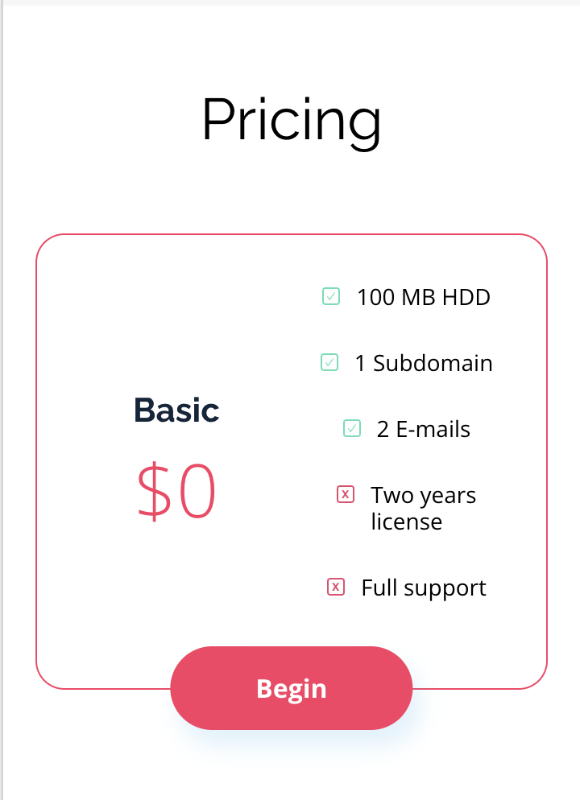
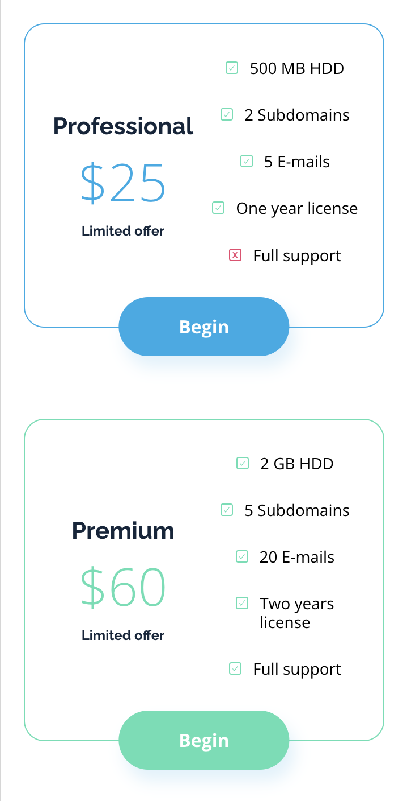
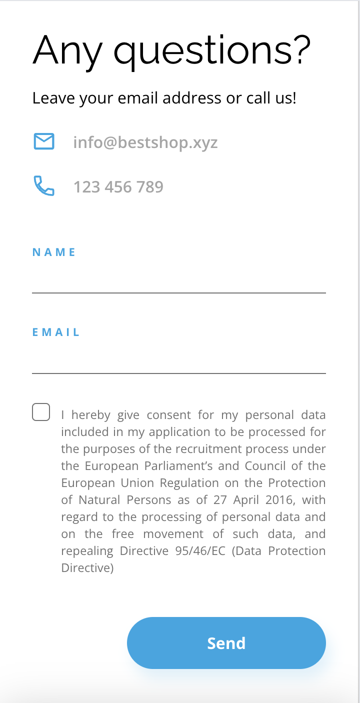

## Aknowledgments:
- Coders Lab- IT School - for the project
- Google Fonts
