# Best Shop

**BestShop** is a responsive website designed to showcase the advantages of an online store. The site features sections that present the key functionalities and benefits of using the e-commerce platform. The project focuses on modern design, responsiveness, and optimization of resource loading (web performance: desktop - 100%, mobile - 93%).

## Live demo:

https://bestshop-rwd-react.netlify.app/

## Tech Stack:

-   React (useState, useEffect)
-   React Router
-   React Scroll
-   SCSS
-   Adobe XD
-   RWD
-   Netlify

## How to run:

-   git clone git@github.com:karolina-rachuta/BestShop_React.git
-   npm install
-   npm run start

## Screenshots:

-   Desktop:

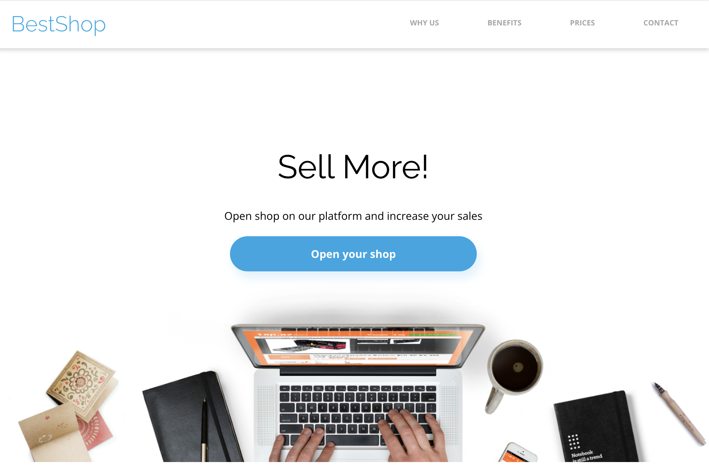
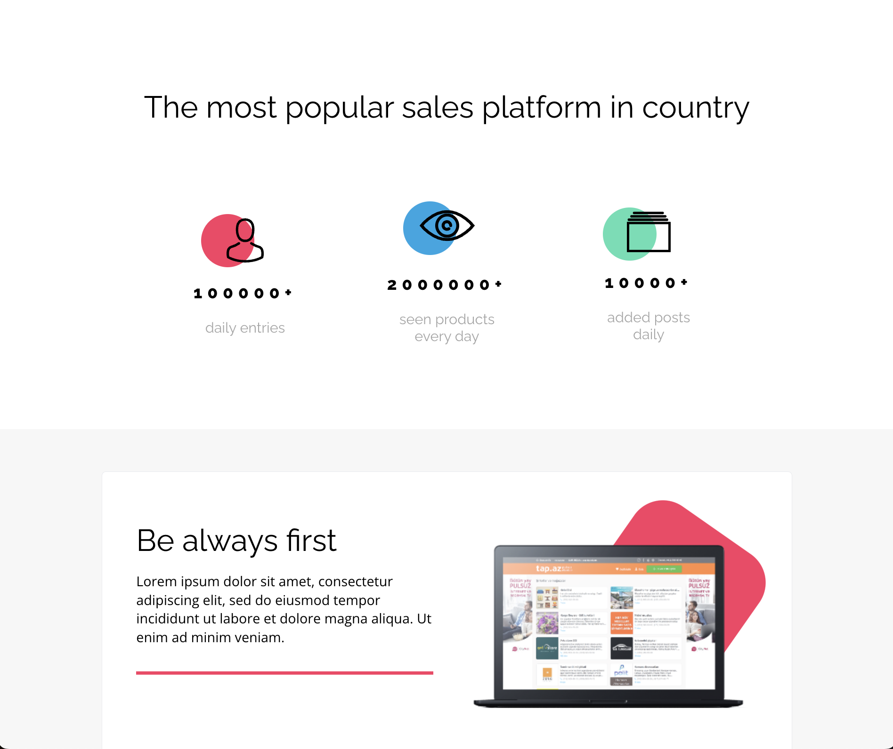
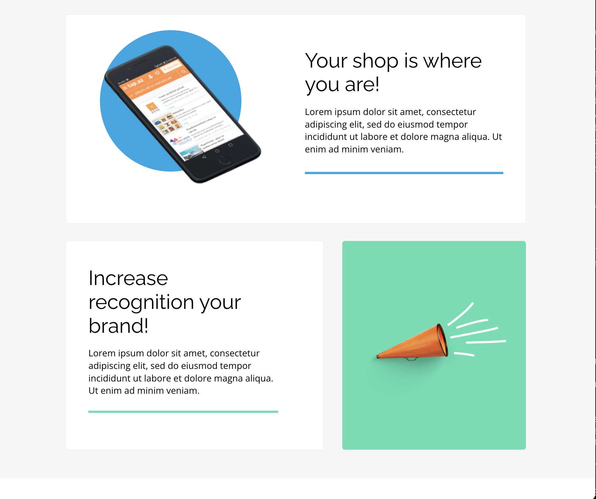
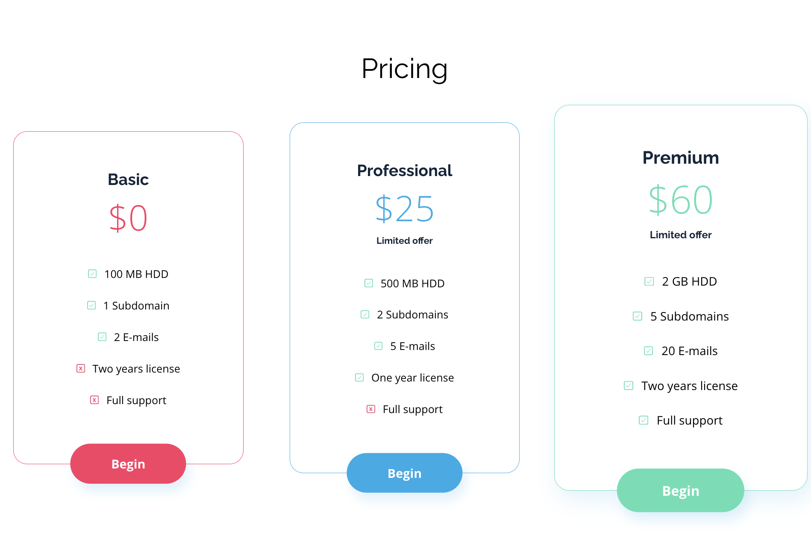
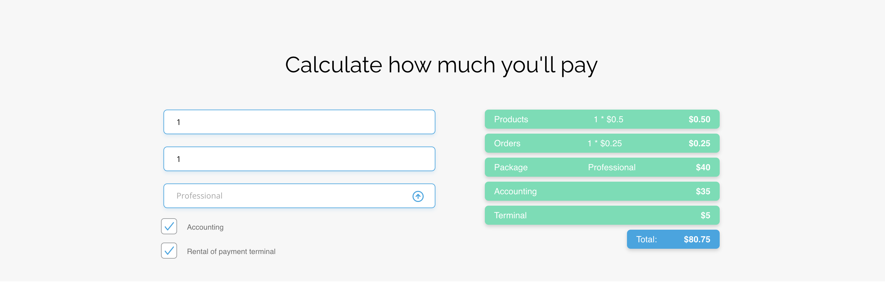
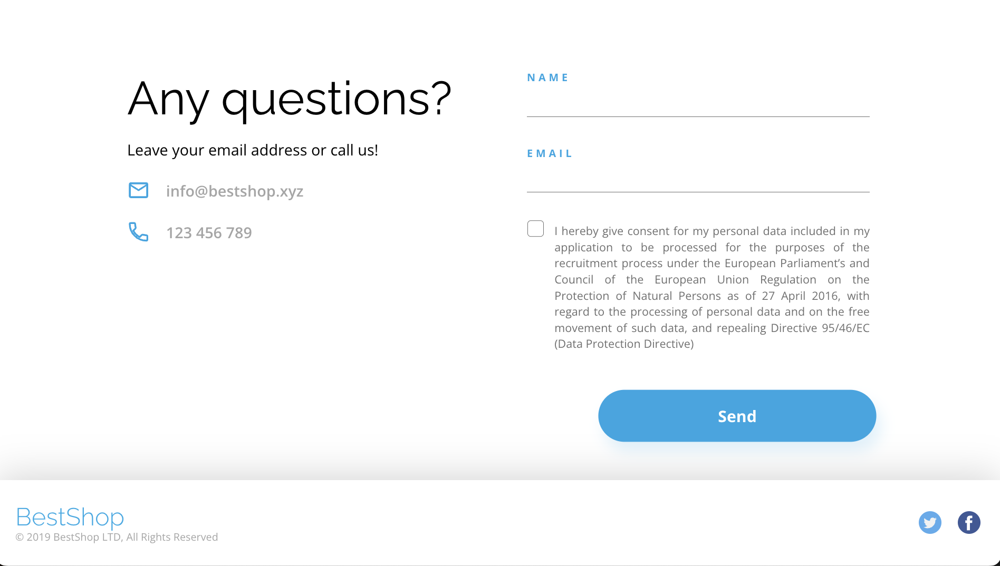

-   Mobile:

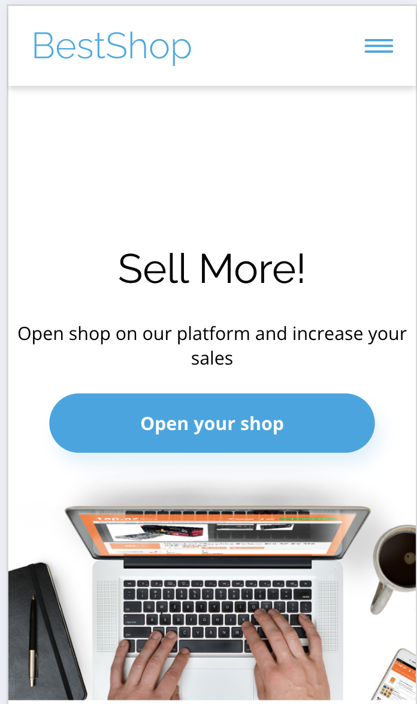
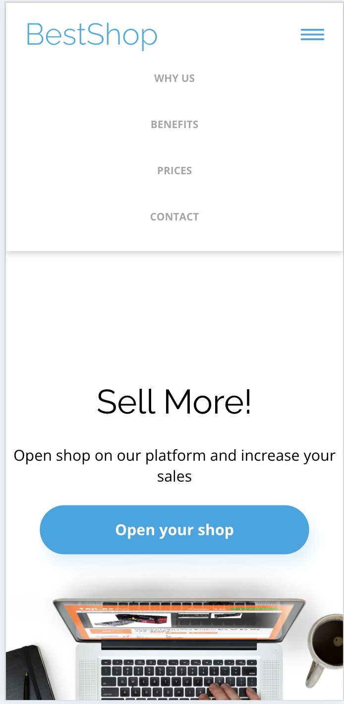
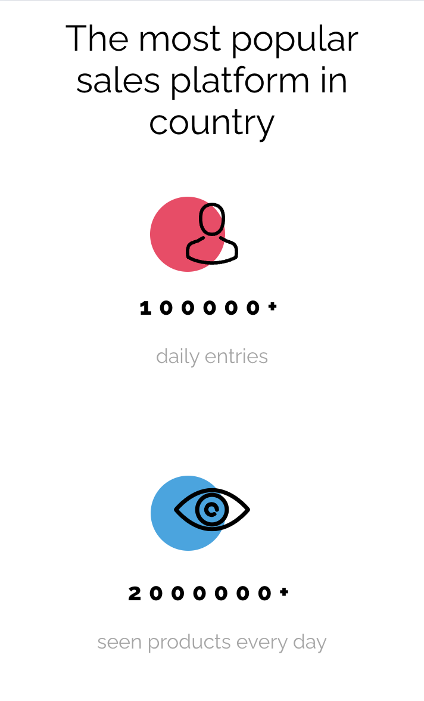
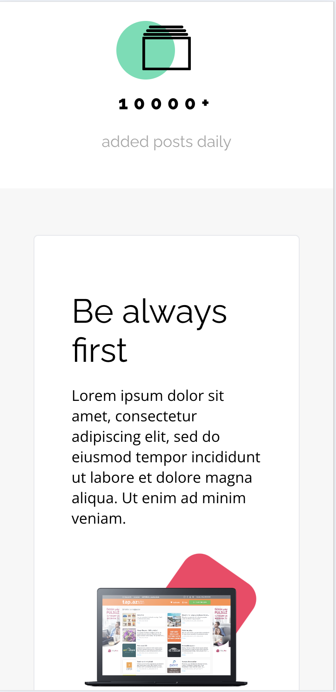
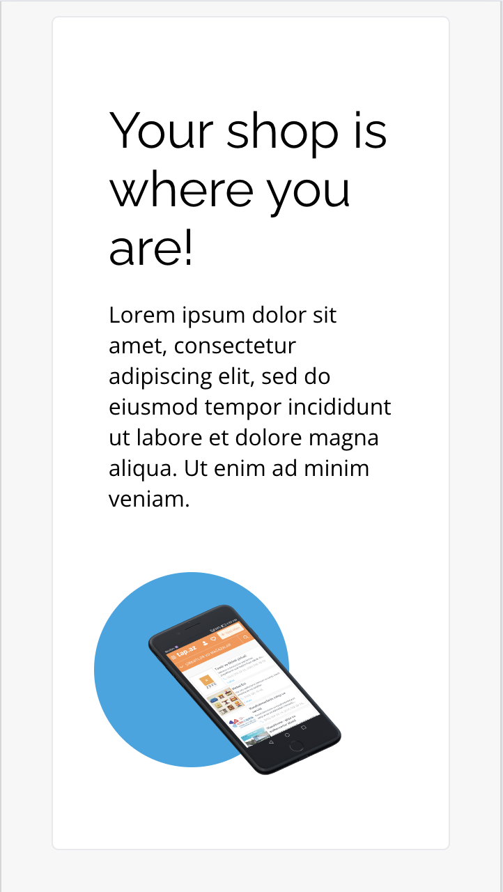
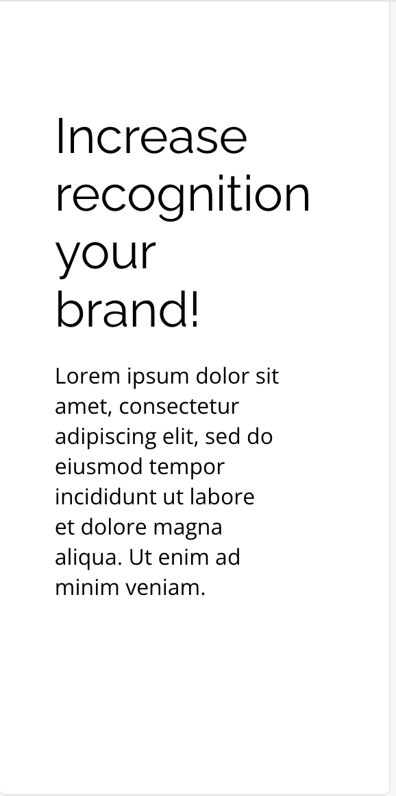
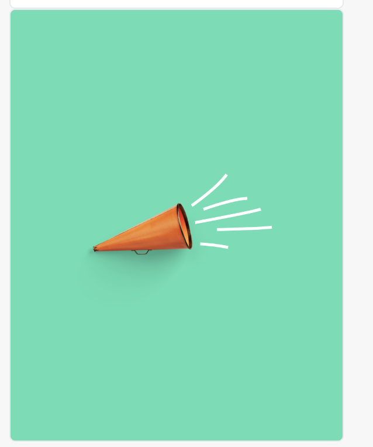
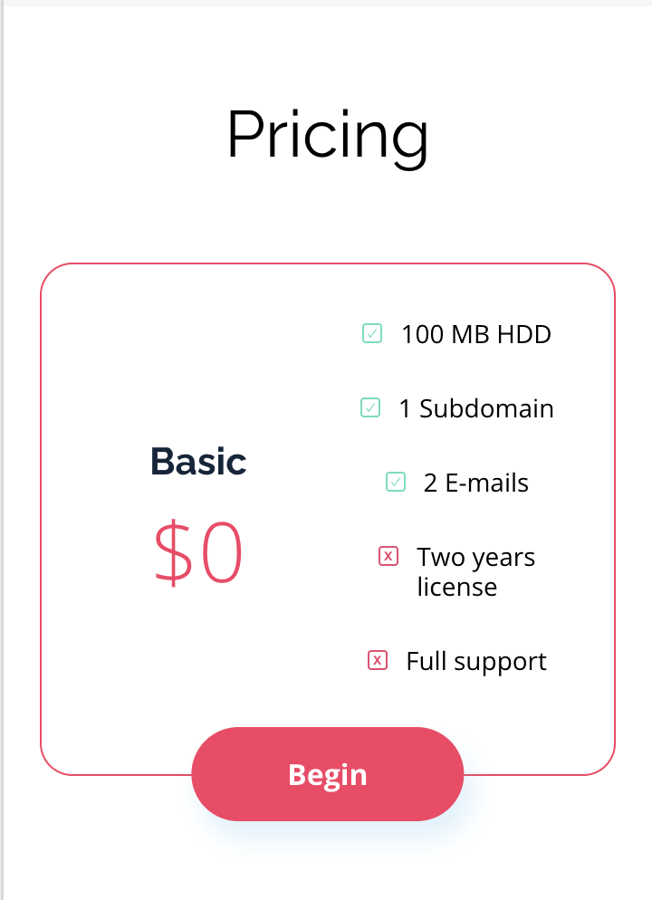
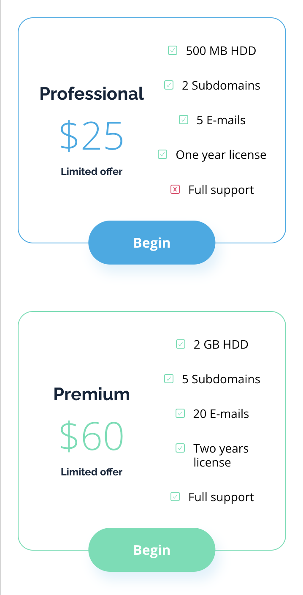
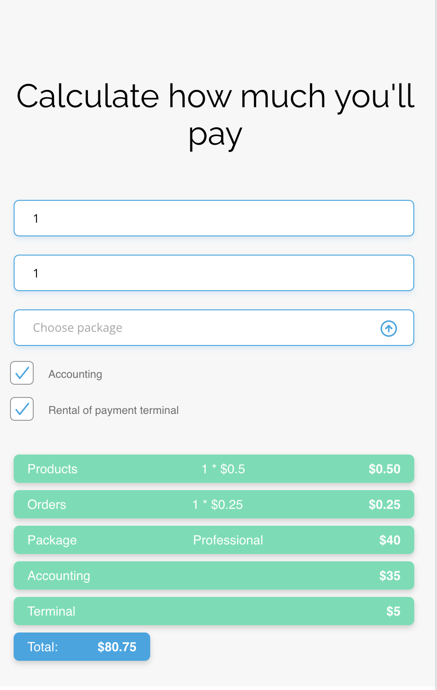
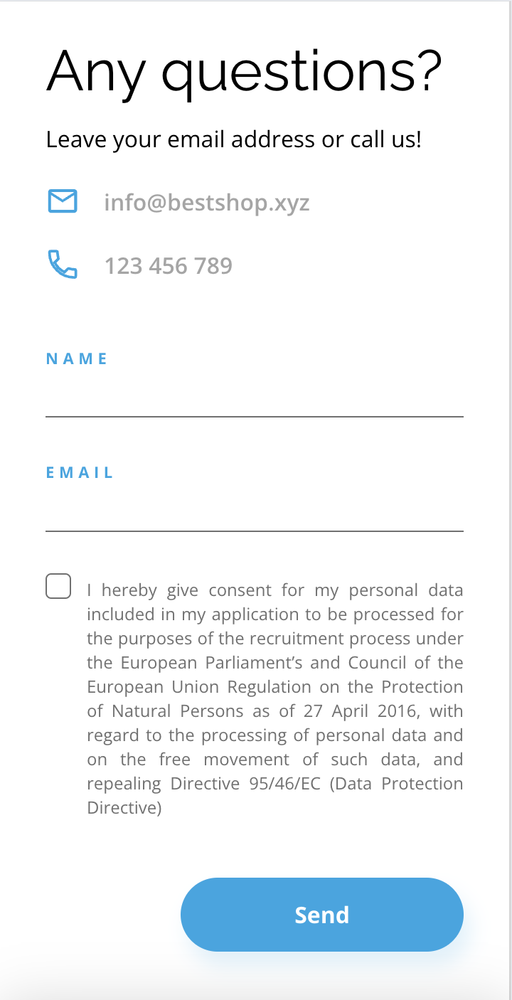

## Aknowledgments:

-   Coders Lab- IT School - for the project
-   Google Fonts

## MIT License:

Copyright &copy; 2024 Karolina Rachuta. All rights reserved.
